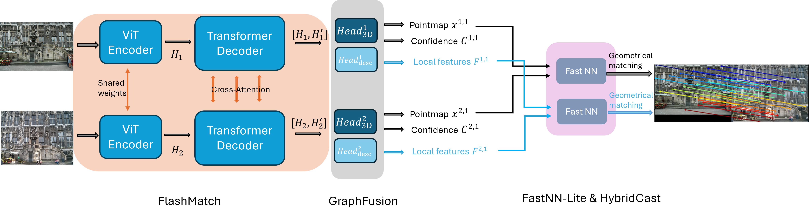

# Speedy MASt3R

Official implementation of `Speedy MASt3R`, a post-training optimiztion framework.

[[paper (comming soon)](./)], [[arxiv](https://arxiv.org/abs/2503.10017)]  

<div style="background-color: white; display: inline-block; padding: 3px; margin-bottom: 10px">
  
</div>

```bibtex
@misc{li2025speedymast3r,
      title={Speedy MASt3R}, 
      author={Jingxing Li and Yongjae Lee and Abhay Kumar Yadav and Cheng Peng and Rama Chellappa and Deliang Fan},
      year={2025},
      eprint={2503.10017},
      archivePrefix={arXiv},
      primaryClass={cs.CV},
      url={https://arxiv.org/abs/2503.10017}, 
}
```


## License

The code is distributed under the CC BY-NC-SA 4.0 License.
See [LICENSE](LICENSE) for more information.

## Get Started

We have tested on `Ubuntu 22.04.3 LTS` with `NVIDIA A40 GPU` and `22.04.5 LTS` with `NVIDIA A5000 GPU`.

### Installation

1. Clone this repo.
```bash
git clone https://github.com/ASU-ESIC-FAN-Lab/speedy_mast3r.git
cd speedy_mast3r
```

2. Set up the environment.
```bash
conda create -n speedy_mast3r python=3.11 cmake=3.14.0
conda activate speedy_mast3r 
conda install pytorch torchvision pytorch-cuda=12.1 -c pytorch -c nvidia  # use the correct version of cuda for your system
pip install -r requirements.txt
pip install -r dust3r/requirements.txt
pip install -r dust3r/requirements_optional.txt
```

3. Compile the cuda kernels for RoPE (as in CroCo v2).
```bash
# DUST3R relies on RoPE positional embeddings for which you can compile some cuda kernels for faster runtime.
cd dust3r/croco/models/curope/
python setup.py build_ext --inplace
cd ../../../../
```

### Checkpoints

We apply post-optimization to basic MASt3R model ([`MASt3R_ViTLarge_BaseDecoder_512_catmlpdpt_metric`](https://download.europe.naverlabs.com/ComputerVision/MASt3R/MASt3R_ViTLarge_BaseDecoder_512_catmlpdpt_metric.pth)). You can obtain and use the model checkpoints, following their [instruction](https://github.com/naver/mast3r?tab=readme-ov-file#mast3r-model).

### Eval Datasets

For 7-Scenes, InLoc, Cambridge, see [Visloc section in DUSt3R](https://github.com/naver/dust3r/blob/main/dust3r_visloc/README.md#dataset-preparation).

For MegaDepth1500 and ScanNet1500, see [Datasets section in Reloc3r](https://github.com/ffrivera0/reloc3r?tab=readme-ov-file#evaluation-on-relative-camera-pose-estimation).

## Usage

When you run `relpose.py` and `visloc.py`, the ONNX binary for the model will be automatically compiled and saved in the `optimized_modules_{GPU_NAME}` directory. This compilation happens only once. After that, the script will automatically load the precompiled ONNX binary.


### Visual Localization

We tested on 7-Scenes, InLoc, and Aachen-Day-Night. See [eval.sh](./eval.sh) for more example.

```bash
# 7Scenes
python3 visloc.py --model_name MASt3R_ViTLarge_BaseDecoder_512_catmlpdpt_metric --dataset "VislocSevenScenes('/path/to/prepared/7-scenes', subscene='chess', pairsfile='APGeM-LM18_top20', topk=1)" --pixel_tol 5 --pnp_mode poselib --reprojection_error_diag_ratio 0.008 --output_dir /path/to/output/7scenes/chess/loc --use_amp --single_loop --use_tensorrt

# InLoc
python3 visloc.py --model_name MASt3R_ViTLarge_BaseDecoder_512_catmlpdpt_metric --dataset "VislocInLoc('/path/to/prepared/InLoc', pairsfile='pairs-query-netvlad40-temporal', topk=1)" --pixel_tol 5 --pnp_mode poselib --reprojection_error_diag_ratio 0.008 --output_dir /path/to/output/inloc/top1/loc --use_amp --single_loop --use_tensorrt

# Aachen-Day-Night
python3 visloc.py --model_name MASt3R_ViTLarge_BaseDecoder_512_catmlpdpt_metric --dataset "VislocAachenDayNight('/path/to/prepared/aachenv11', subscene='day', pairsfile='fire_top50', topk=1)" --pixel_tol 5 --pnp_mode poselib --reprojection_error_diag_ratio 0.008 --output_dir /path/to/output/aachen/top1/day/loc --use_amp --single_loop --use_tensorrt
```

### Relative Pose Estimation

We tested on MegaDepth1500 and ScanNet1500. See [eval.sh](./eval.sh) for more example.

```bash
# MegaDepth1500
python relpose.py --model_name MASt3R_ViTLarge_BaseDecoder_512_catmlpdpt_metric --dataset "RelPoseMegaDepth1500('/path/to/prepared/reloc3r_dataset/megadepth1500', pairsfile='megadepth_test_pairs', resolution=(512,384))" --pose_estimator cv2 --use_amp --single_loop --use_tensorrt

# ScanNet1500
python relpose.py --model_name MASt3R_ViTLarge_BaseDecoder_512_catmlpdpt_metric --dataset "RelPoseScanNet1500('/path/to/prepared/reloc3r_dataset/scannet1500', pairsfile='test', resolution=(512,384))" --pose_estimator cv2 --use_amp --single_loop --use_tensorrt
```

## Acknowledgments
Thanks to these great repositories: [Croco](https://github.com/naver/croco), [DUSt3R](https://github.com/naver/dust3r), [MASt3R](https://github.com/naver/mast3r), [Reloc3r](https://github.com/ffrivera0/reloc3r), [glue-factory](https://github.com/cvg/glue-factory), and many other inspiring works in the community.